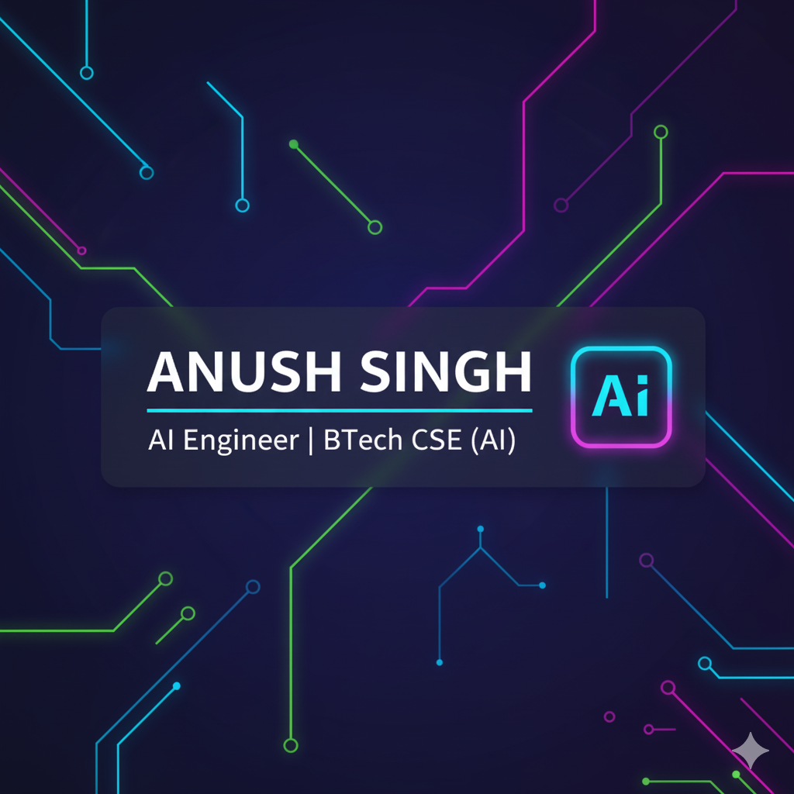

# 👋 Hey, I'm Anush Singh  
### AI Engineer • Specializing in Generative AI and Agent Building

  

---

## 🎯 Focused Areas  

- 🤖 **AI Engineering** – Agent making using **Scikit-Learn, Keras, Matplotlib, Pandas, NumPy**
- 🧠 **Algorithmic Problem Solving** – Solved **165+ LeetCode problems**
- 📘 **AI & ML Projects**
  - **Text Classification** with TensorFlow  
  - **Object Detection** using TensorFlow  
  - **Landmark Detection**
- 🛠 **Practical Automation** – Python utilities, local AI tools, agent development
---

## ⚡ Tech Stack

    <!-- Languages -->
    
    
    
    
    
    <!-- Python Libraries -->
    
    
    
    
    
    
    <!-- AI Agent -->
    

## 🚀 Featured AI Project  

### 💾

---

## 📊 GitHub Stats  

  

---

## 🧩 LeetCode Progress  

  

---

## 📫 Connect With Me  

- 📧 Email: 2k23.csai2310942@gmail.com  
- 🔗 LinkedIn: https://www.linkedin.com/in/anush-singh-8bb0a12a0

---

  <i>“Build AI Agents which can be aded to any app or website for AI assistance.”</i>

