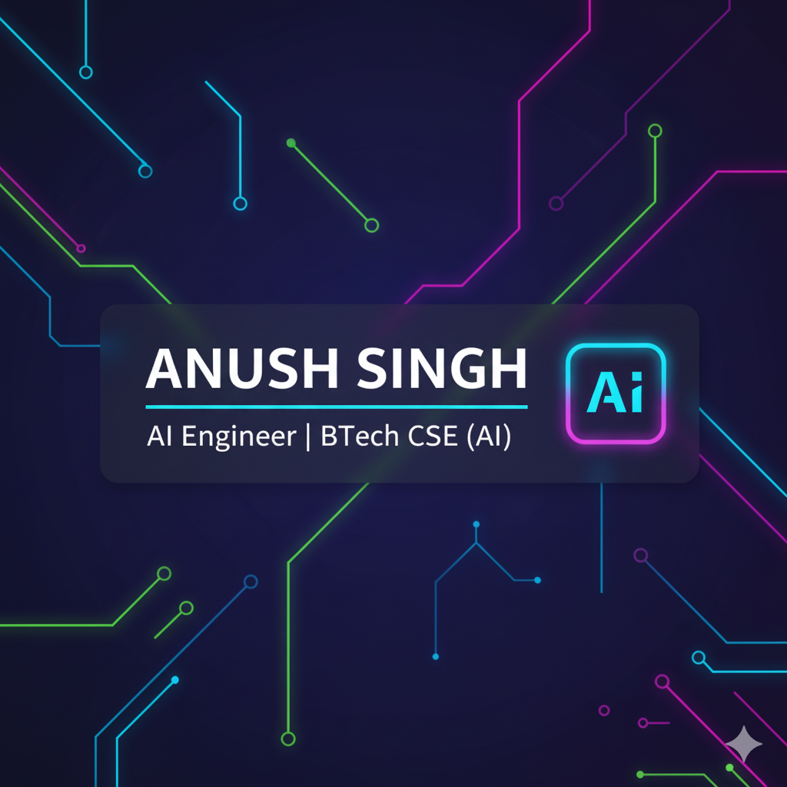

# 👋 Hey, I'm Anush Singh

### 🤖 AI Engineer | Generative AI & AI Agent Developer

<p align="center">
  
</p>

<p align="center">
  
</p>

<p align="center">
  <a href="https://github.com/Anush-Singh">
    
  </a>
  <a href="https://github.com/Anush-Singh?tab=repositories">
    
  </a>
  <a href="https://leetcode.com/u/Anush_Singh/">
    
  </a>
</p>

---

## 🚀 About Me

I'm a **Computer Science & Artificial Intelligence student** passionate about building practical AI-powered applications.

My primary interests include:

* 🤖 **Generative AI & AI Agents**
* 🧠 **Machine Learning & Deep Learning**
* 🐍 **Python Development**
* 🔎 **RAG & Intelligent Search**
* ⚙️ **AI-powered Automation**
* 📊 **Data Science & Predictive Analytics**
* 🧩 **Problem Solving & DSA**

I enjoy turning ideas into working products by combining **AI, backend systems, APIs, databases, and intelligent automation**.

---

## 🎯 What I'm Currently Focused On

```text
🤖 Generative AI
🧠 AI Agents & Multi-Agent Systems
🔗 RAG & LLM Applications
🐍 Python & Machine Learning
⚡ FastAPI & Backend Development
🗄️ SQL & Database Systems
🧩 Data Structures & Algorithms
🌍 AI-powered Real-World Applications
```

---

# 🚀 Featured Projects

## ✈️ Travel Buddy 2.0

**Agentic AI-Based Travel Planning System**

A multi-agent AI travel assistant designed to create **personalized, explainable and geographically optimized travel plans**.

### Key Features

* 🤖 Multi-Agent AI architecture
* 🗺️ Geospatial & distance optimization
* 🧠 LLM-powered travel planning
* 🔎 RAG-based knowledge retrieval
* 📍 Personalized itinerary generation
* ⚡ Constraint-based planning
* 💡 Explainable AI recommendations
* 🌐 Search & travel API integration

🔗 **GitHub:**
https://github.com/Anush-Singh/TravelBuddy

---

## 🚢 Marine Vessel Monitoring System

**AI-powered Maritime Analytics & Vessel Intelligence**

A machine-learning-based system designed to monitor vessel performance, predict fuel consumption and identify operational risks.

### Key Features

* 🚢 Real-time vessel monitoring
* ⛽ Fuel consumption prediction
* 📊 Vessel performance analytics
* 🧠 Machine Learning predictions
* ⚠️ Anomaly & risk analysis
* 🔌 FastAPI backend
* 🗄️ SQL Server integration
* 🤖 AI-powered query system

### ML Models

* Linear Regression
* Decision Tree Regressor
* Random Forest Regressor

🔗 **GitHub:**
https://github.com/aishwaryguptadz/MarineVesselMonitoringSystem

---

## 🎬 Movie Recommendation System

**Content-Based Movie Recommendation Engine**

A recommendation system that suggests movies based on similarity between movie characteristics.

### Key Concepts

* 🎥 Movie dataset processing
* 🧹 Data preprocessing
* 🔢 Feature extraction
* 📐 Similarity calculation
* 🎯 Personalized recommendations
* 🐍 Python-based ML pipeline

🔗 **GitHub:**
https://github.com/Anush-Singh/Movie_Recommendation_System

---

## 🏠 Rent & Flatmate Finder

**Web Platform for Finding Rental Properties & Flatmates**

A full-stack application designed to help users discover rental properties and compatible flatmates.

### Key Features

* 🏠 Property listings
* 🔍 Search & filtering
* 👥 Flatmate discovery
* 📝 Add and manage listings
* 🔌 REST API integration
* 💻 Interactive web interface

🔗 **GitHub:**
https://github.com/Anush-Singh/Rent_and_Flatmate

---

# 🧠 AI & ML Projects

I've worked on multiple AI/ML projects involving:

* 📝 Text Classification using TensorFlow
* 🎯 Object Detection
* 📍 Landmark Detection
* 🎬 Recommendation Systems
* 🚢 Predictive Analytics
* 🤖 AI Agents
* 🔎 RAG-based Applications
* 🌐 AI-powered Web Applications

---

# ⚡ Tech Stack

### 👨‍💻 Languages

<p align="center">
  
  
  
  
  
</p>

### 🤖 AI / Machine Learning

<p align="center">
  
  
  
  
</p>

### 📊 Data & Visualization

<p align="center">
  
  
  
</p>

### ⚙️ Development & Backend

<p align="center">
  
  
  
  
</p>

---

# 🧩 Problem Solving

<p align="center">
  
</p>

### 🏆 LeetCode

**250+ Problems Solved**

Focused on:

* Arrays & Strings
* Hashing
* Linked Lists
* Stacks & Queues
* Trees
* Binary Search
* Recursion
* Dynamic Programming
* Greedy Algorithms
* Graphs

🔗 **LeetCode:**
https://leetcode.com/u/Anush_Singh/

---

# 📊 GitHub Stats

<p align="center">
  
</p>

<p align="center">
  
</p>

---

# 🌱 Currently Learning

* 🧠 Advanced Generative AI
* 🤖 Autonomous AI Agents
* 🔗 RAG & Vector Databases
* 🧩 Multi-Agent Systems
* ⚡ LLM Application Development
* 🏗️ AI System Design
* ☁️ AI Application Deployment

---

# 📫 Connect With Me

<p align="center">
  <a href="mailto:2k23.csai2310942@gmail.com">
    
  </a>
  <a href="https://www.linkedin.com/in/anush-singh-8bb0a12a0">
    
  </a>
  <a href="https://github.com/Anush-Singh">
    
  </a>
  <a href="https://leetcode.com/u/Anush_Singh/">
    
  </a>
</p>

---

<p align="center">
  <i>“Building intelligent AI agents that can bring real value to everyday applications.”</i>
</p>

<p align="center">
  ⭐ If you find my projects interesting, consider giving them a star!
</p>
